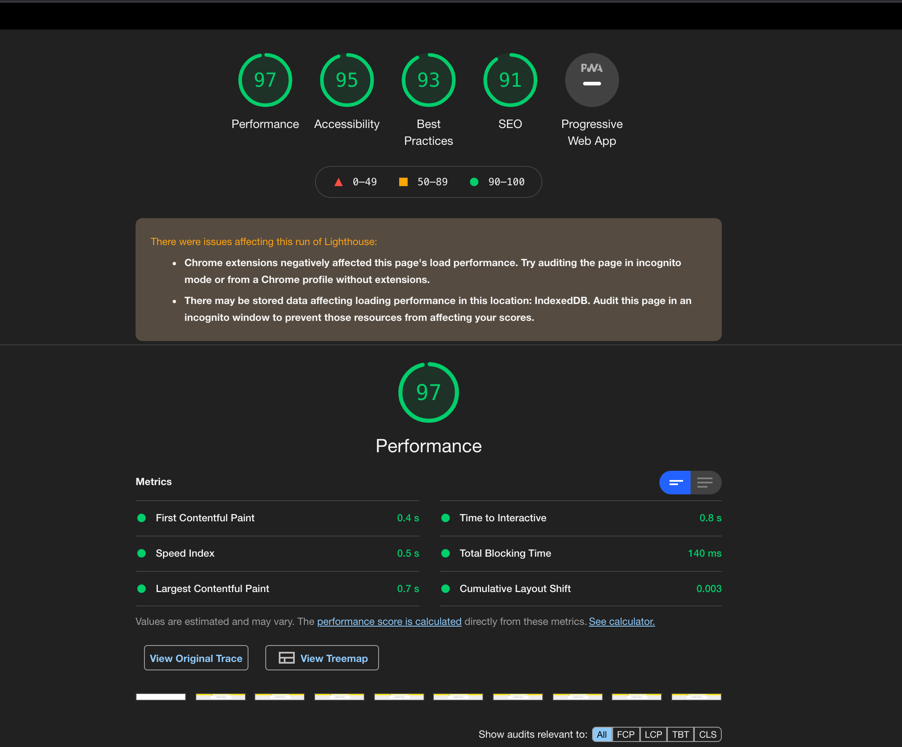

# Getting Started

## System Requirements

- [Node.js](https://nodejs.org/en/) 10 or later
- MacOS, Windows (including WSL), and Linux are supported

## Setup

1. Clone this repo using `git clone --depth=1 git@github.com:wootsbot/challenge-MELI.git <YOUR_PROJECT_NAME>`
2. Move to the appropriate directory: `cd <YOUR_PROJECT_NAME>`.
3. Run `yarn` or `npm install` to install dependencies .
4. Run `yarn dev` or `npm run dev` to see the example app at `http://localhost:3000`.
5. Run `yarn test` or `npm run test` to see run test.

These scripts refer to the different stages of developing an application:

- `dev` - Runs `next` which starts Next.js in development mode
- `build` - Runs `next` build which builds the application for production usage
- `start` - Runs `next` start which starts a Next.js production server

Now you're ready to rumble! :traffic_light:

## Result lighthouse

